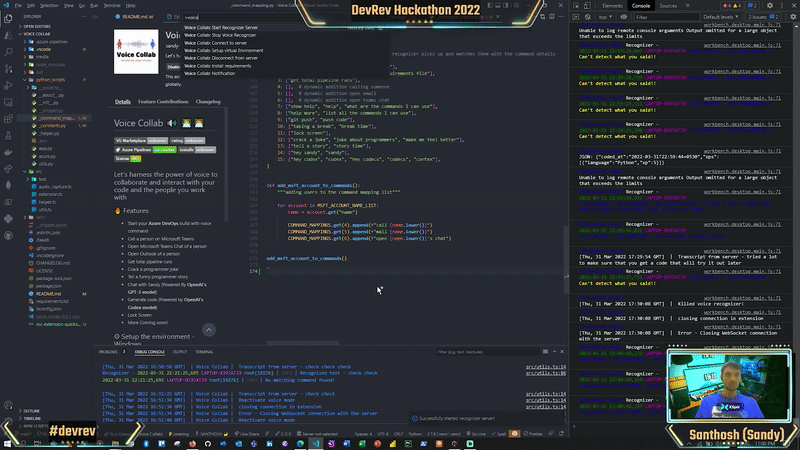

# Voice Collab 🔊 👨‍💻👩‍💻 🦻
---

 

## Let's harness the power of voice to collaborate and interact with your code and the people you work with

## 🔥 What it can do?

- ▶ Trigger your **Azure DevOps** pipeline build with just your voice
- 📞 Call a person on Microsoft Teams
- 🗣 Open Microsoft Teams Chat of a person
- 📩 Open Outlook of a person 
- 🔁 Get total pipeline runs
- 😅 Crack a programmer joke
- 📝 Tell a funny programmer story
- 🤖 Chat with Sandy (Powered By **OpenAI's GPT-3 model**)
- 👾 Generate code (Powered by **OpenAI's Codex model**)
- 🔒 Lock Screen
- More Coming soon!

## ⚙ Setup the environment - Windows
- Requires - `Python 3.7 and above`
- Requires - `node ^12`
- Once you install the extension, hit Ctrl+r to open RUN and type `%USERPROFILE%\.vscode\extensions`
- Search for sandy-codes-py voice collab extension
- Open a Powershell/command prompt inside the extension folder and `npm install`
- This will install all the node modules required
- Inside the same folder create a python virtual environment `py -m venv venv`
- Activate the environment and install the requirements `venv/Scripts/pip install -r requirements.txt`
- Restart VS Code again, you should see a 🔇stopped icon in the status bar and a notification if the setup was successful ✅
- Check the Developer tools for errors and logging info
- The Microsoft Team call and outlook email option will use your `default browser`, change this from the system settings if you want then to open up in other browsers
- You need **internet connectivity** to get the speech transcription from Google's API

Create `.env` file inside `python_scripts` folder with the following to make the API's work
1. PERSONAL_ACCESS_TOKEN = "<paste your key>"
2. OPENAI_API_KEY = "<paste your key>"

Once you've set all the above them your good to go 🏁

## 🦾 Commands to invoke
    Description - Trigger phrases
    
    1. Triggering Azure DevOps pipeline - say, start build or trigger pipeline build
    2. Create the requirements.txt file - say, create requirements.txt or create requirements file
    3. Get all Azure DevOps pipeline runs count - say, get total pipeline runs
    4. Call someone on Microsoft Teams - say, call megan
    5. Email someone on Outlook - say, email megan
    6. Open up someone's Microsoft Teams Chat - say, open megan's chat
    7. Speak out 5 commands you can use - say, show help or  help or what are the commands I can use
    8. Speak out all the commands you can use - say, help more or list all the commands I can use
    9. Push the code to remote - say, git push or push code (still in progress)
    10. Commit code and lock the screen - say, taking a break or break time
    11. Lock the user screen - say, lock screen
    12. Crack a random programmer joke - say, crack a joke or joke about programmers or make me feel better
    13. Narrate a random story - say, tell a story or story time
    14. Chat with Sandy - say, hey sandy or sandy and then say the phrase you wanna ask 
        Example: Am I the best programmer in the world?
    15. Generate code - say, hey codex or codex and then say what you want 
        Example: Create a Python class with name Employee, Create a Python dictionary with country and it's capitals

## 📌 FAQ
- The speech recognition is done with **Google's free speech to text API** - get a paid API for a smoother experience
- Install PyAudio as `pipwin install pyaudio`, but first install pipwin as `pip install pipwin` - This is not needed but just in case
- Open developer tools from Help> Toggle Developer Tools in VS Code to see the logs
- You can add more people from your org into the `MSFT_ACCOUNT_NAME_LIST` in `_constants.py` file

## 💡 License

This project is released under the MIT license.